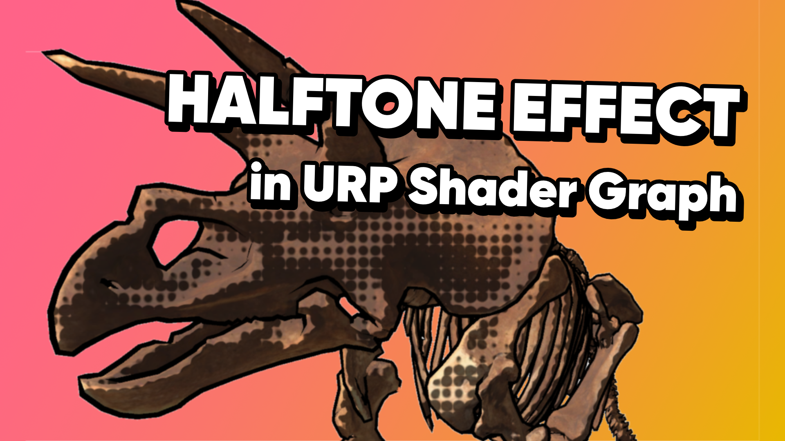

# Halftone Shader in Unity Shader Graph and URP

A halftone shader created with Shader Graph for use in the Universal Render Pipeline.

## Overview

Halftone is a technique used in printing where you layer a small number of differently-coloured inks on top of each other, in a pattern of variable-size dots, to form new colours. A similar type of dot pattern is sometimes used as an element of the Pop Art style, where just one layer of coloured dots appears to form a shading gradient on a surface. 

This repository contains a shader that calculates the diffuse lighting on an object and automatically converts those values into darkened dots at each point on the object.

## Software

This project was created using Unity 2021.3.0f1 (LTS) and Shader Graph/URP 12.1.6.

## Tutorials

Coming soon - tutorials based on this project!

## Authors

This project was released on July 27th 2022.
